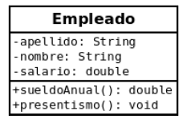

##  FORMULARIO EMPLEADO

Descargue la carpetaPractico5_Empleado, descomprimala y dejela en su carpeta Workspace de eclipse (recuerde que tiene que importar desde eclipse la carpeta que le queda adentro con el mismo nombre)

Desarrollar el formulario FrmEmpleado con la siguiente información:

 
Recordar que los métodos: 

• ** public double sueldoAnual()** : El método devuelve el salario anual percibido.

• ** public void presentismo()**: Incrementa el valor de salario en un 10%.

• ** public String toString()** : Devuelve atributos y salarioAnual().
Debe tener dos botones (además de Limpiar y Salir):
1) Botón "Salario Anual" que al presionarlo despliegue en otro campo de texto el salario anual. 
2) Botón "Presentismo" que al presionarlo modifique el campo de texto del salario anual, habiendole sumado el presentismo correspondiente.

#### Una vez resuelto el ejercicio, borre la carpeta carpeta Practico5_Empleado (la que está aquí) y suba su proyecto (el que tiene en Workspace de eclipse)
